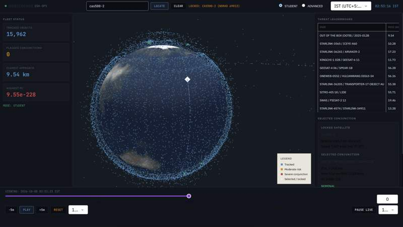

# OrbitSense

Interactive satellite conjunction awareness dashboard for education and research, using live TLE data, SGP4 propagation, and a Dash/Plotly interface.

> **Important disclaimer:** OrbitSense is an educational/research demonstrator, **not** an operational collision-avoidance system. Do not use it for real mission maneuver decisions.

## Canonical app entry point

- **Run:** `python /home/runner/work/orbitsense/orbitsense/live_tracker_v8.py`
- `live_tracker_v8.py` is the maintained canonical dashboard entry point.
- Older tracker versions are preserved under `/home/runner/work/orbitsense/orbitsense/archive/experiments/` as historical references.

## Features

- Live active-satellite ingestion from CelesTrak with local cache fallback (`tle_cache.txt`)
- SGP4-based propagation and conjunction candidate screening
- Fine-resolution closest-approach refinement with pairwise propagation safeguards
- Search and lock workflow that supports blank input handling, NORAD IDs, case-insensitive/partial name lookup, explicit no-match feedback, repeated locking, and clear/unlock reset
- Empirical uncertainty model and probability-of-collision estimate
- Student and advanced dashboard modes, with simple maneuver sandbox
- Historical validation and additional experiment scripts

## Dashboard preview



*Live satellite fleet, selected satellite, and conjunction leaderboard.*

## Architecture and data flow

1. Fetch TLE catalog (prefer cache when fresh, fallback to cache on network errors)
2. Parse satellites and propagate state vectors
3. Coarse candidate filtering by orbital shell and miss distance
4. Fine pair propagation for each candidate and closest-approach extraction
5. Risk ranking and probability-of-collision estimation
6. Interactive Dash visualization and controls

## Installation

```bash
git clone https://github.com/Shrestha3511/orbitsense.git
cd orbitsense
python -m venv .venv
source .venv/bin/activate  # Windows PowerShell: .venv\Scripts\Activate.ps1
pip install -r requirements.txt
```

## Run the canonical dashboard

```bash
python live_tracker_v8.py
```

Open: <http://127.0.0.1:8050>

## TLE/network/caching notes

- OrbitSense fetches live TLE data from CelesTrak.
- Cached data is stored in `tle_cache.txt` (2-hour freshness window).
- If CelesTrak is unavailable, startup falls back to cache when available.
- Earth texture fetch has retry + graceful fallback to a procedural texture.

## Experiments

```bash
python historical_validation.py
python risk_map.py
python orbit_visual.py
python cam_simulator.py
python first_test.py
```

Legacy tracker snapshots:

- `/home/runner/work/orbitsense/orbitsense/archive/experiments/live_tracker_v1.py` ... `live_tracker_v7.py`

## Repository structure

```text
live_tracker_v8.py              Canonical Dash app
uncertainty_model.py            Empirical uncertainty and Pc model
historical_validation.py        Iridium 33 / Cosmos 2251 validation
cam_simulator.py                Maneuver simulation experiment
risk_map.py                     Batch conjunction-risk visualization
orbit_visual.py                 Basic orbital track visualization
first_test.py                   Minimal TLE + SGP4 connectivity script
archive/experiments/            Historical live tracker versions (v1-v7)
assets/style.css                Dashboard styling and responsive tweaks
tests/                          Pytest coverage for core scientific logic
```

## Testing

Install dev dependencies and run tests:

```bash
pip install -r requirements-dev.txt
pytest -q
python -m compileall -q .
```

Tests are intentionally offline and do not rely on live CelesTrak or remote texture downloads.

## Public policy documents

- [TERMS.md](TERMS.md)
- [PRIVACY.md](PRIVACY.md)

## Scientific limitations

- TLE/SGP4 uncertainty is simplified and not mission-grade covariance analysis
- Collision probability model uses simplified assumptions
- Finite prediction window and temporal sampling can miss edge cases
- Risk ranking is anomaly-based and contextual to sampled population

## Data sources and attributions

- [CelesTrak](https://celestrak.org/) (TLE data)
- [sgp4 Python package](https://pypi.org/project/sgp4/)
- [Plotly](https://plotly.com/python/)
- [Dash](https://dash.plotly.com/)
- Earth texture source (when available): [three.js textures](https://github.com/mrdoob/three.js/tree/dev/examples/textures/planets)

## Roadmap

- [ ] Add packaged app configuration and environment variable controls
- [ ] Add more deterministic unit tests for conjunction pipelines
- [ ] Add reproducible benchmark subset for algorithm tuning
- [ ] Add dashboard screenshot/GIF for portfolio presentation

## License

This project is licensed under the MIT License. See `LICENSE`.
